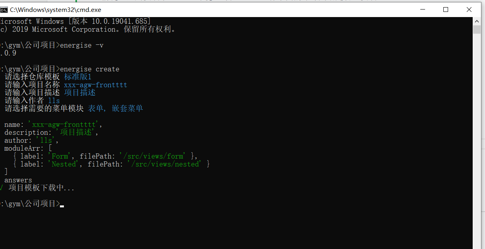
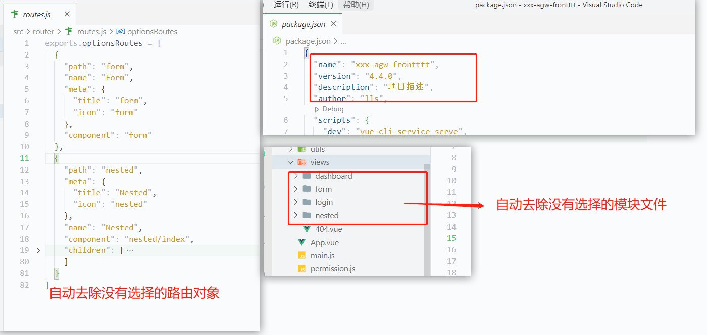

<!--
 * @Author: guanyaoming guanyaoming@linklogis.com
 * @Date: 2022-11-30 14:11:19
 * @LastEditors: guanyaoming guanyaoming@linklogis.com
 * @LastEditTime: 2022-12-06 11:55:48
 * @FilePath: \energise-cli\README.md
 * @Description: 这是默认设置,请设置`customMade`, 打开koroFileHeader查看配置 进行设置: https://github.com/OBKoro1/koro1FileHeader/wiki/%E9%85%8D%E7%BD%AE
-->
# energise-cli

#### 解决的问题
1. 解决每次项目初始化的时候，需要手动 copy 标准版的文件到指定目录；
2. 自动更改 packjson 配置文件的项目属性；
3. 因为在前端，全部模块的内容都在一个仓库里，该库解决在全量模块中，可自主选择新项目需要的模块，如 还款模块、授信模块；
4. 自动删除未选择模块的目录、路由文件、菜单（菜单在前端写死的情况下）；
  
#### 项目配置
1. templates.json 文件里配置了有哪些标准项目，对象项目的仓库地址，包含模块；
2. 当前是在网上找了某个 vue2 的模板仓库，并做了对应的配置处理；

#### 局限性
1. 当前赋能的标准版不适配本库，因为不是每个项目一进来就可以使用该库，要进行模板改造。
2. 主要 要对路由文件进行改造。

#### TODO
1. 可支持选择标准版的分支；(当前只针对 master 分支)
2. 可通过命令随时 增删改 模板选项；（当前如果要增删改模板选项，需要到 templates.json 操作）
3. 可支持筛选二级模块


### 使用方法
1. 前提：全局安装了 node 环境，可在 cmd 运行下面的命令判断是否已安装。
```
  node -v
  npm -v
```
2. 运行 npm i -g energise-cli ,安装该库。可运行下面的命令判断是否安装成功
```
  energise -v
```
3. 在要新建项目的目录下运行下面的命令：
```
  energise create 
```
4. 部分效果图

